# Modèle de données

Base SQL Server 2022, avec Prisma 7 (générateur `prisma-client` et adaptateur `@prisma/adapter-mssql`). Le schéma de référence est `prisma/schema.prisma` ; la migration initiale est `prisma/migrations/*_init_domain_model`.

## Diagramme entité-relation

```mermaid
erDiagram
    Site ||--o{ SiteExternalId : "identifiants externes"
    Site ||--o| Lease : "bail (1-1)"
    Site ||--o| ServiceContract : "contrat de prestation (1-1)"
    Site ||--o| SiteTechnical : "technique (1-1)"
    Site ||--o{ BuildingWork : "travaux"
    Site ||--o| SiteIcpe : "ICPE (1-1)"
    Site ||--o{ IcpeHeading : "rubriques ICPE"
    Site ||--o| SiteEnergyProfile : "énergie (1-1)"
    Site ||--o{ AnnualMetric : "indicateurs annuels"
    Site ||--o| SiteGeometry : "emprise (1-1)"
    Site ||--o{ SitePublicData : "données publiques"
    Site ||--o{ SitePlan : "plans"
    Site ||--o{ Equipment : "équipements"
    Site ||--o{ Document : "documents"
    Document |o--o{ SitePlan : "image du plan (NoAction)"
    SitePlan |o--o{ Equipment : "position sur plan (NoAction)"
    User |o--o{ Document : "déposé par (NoAction)"
    User |o--o{ SitePlan : "calibré par (NoAction)"
    User |o--o{ ImportBatch : "lancé par (SetNull)"
    User ||--o{ Session : "sessions (NoAction)"

    Site {
        nvarchar id PK
        nvarchar code UK "ENTREPOT"
        nvarchar name
        decimal latitude "9,6"
        decimal longitude "9,6"
        nvarchar commune_insee_code "5, enrichissement"
        int version "concurrence optimiste"
        datetime archived_at "archivage logique"
    }
    Lease {
        nvarchar site_id UK
        nvarchar code UK "unique si renseigné"
        date notice_date
        date next_exit_date
        int notice_period_months
    }
    AnnualMetric {
        nvarchar site_id FK
        int year
        nvarchar metric "catalogue"
        decimal value "18,4"
        nvarchar source "CHECK"
    }
    SitePublicData {
        nvarchar site_id FK
        nvarchar provider "UK (site, provider, key)"
        nvarchar key
        nvarchar value_json "JSON"
        nvarchar batch_id
    }
    AuditLog {
        bigint id PK "auto-incrément"
        nvarchar entity_type
        nvarchar entity_id
        nvarchar site_id "sans clé étrangère"
        nvarchar action "CHECK"
        nvarchar source "CHECK"
    }
    ImportBatch {
        nvarchar kind
        nvarchar status
        nvarchar stats_json
    }
    User {
        nvarchar email UK "minuscules"
        nvarchar role "CHECK"
    }
```

`AuditLog` n'a volontairement **aucune relation** : il référence les entités par `entity_type`, `entity_id`, `site_id`, `actor_id` et `batch_id`, sans clé étrangère.

## Rôle des tables

| Table (modèle) | Cardinalité | Rôle |
|---|---|---|
| `sites` (`Site`) | — | Identité, organisation, adresse et coordonnées de l'entrepôt. Racine de toutes les données métier. `code` = ENTREPOT. `commune_insee_code` (5 caractères, Corse `2A`/`2B`) et `coordinates_source` (`import`, `manual`, `enrichment`) sont renseignés par l'enrichissement lorsqu'ils sont vides. |
| `site_external_ids` (`SiteExternalId`) | 0..n par site, **plusieurs par système possibles** | Identifiants dans les autres systèmes (`QLIK_SENSE`, `AL_CODE`, `RAMSES`). Unicité sur (système, valeur) : un identifiant n'appartient qu'à un site. Un site peut avoir plusieurs clés Qlik (l'unicité (site, système) a été supprimée à l'étape 4). |
| `leases` (`Lease`) | 0..1 par site | Le bail : dates, préavis, négociation, franchise, loyers contractuels. Un bail correspond à un seul entrepôt. La date d'arbitrage n'est pas stockée. |
| `service_contracts` (`ServiceContract`) | 0..1 par site | Contrat de prestation logistique. |
| `site_technicals` (`SiteTechnical`) | 0..1 par site | Qualité, hauteur, surfaces (m²), capacités, spécificités. |
| `building_works` (`BuildingWork`) | 0..n par site | Construction, réhabilitation, extension (remplace les trois colonnes de dates). `date_precision` (`day`, `month`, `year`) indique si la date n'est connue qu'au mois ou à l'année. |
| `site_icpes` (`SiteIcpe`) | 0..1 par site | Porteur ICPE, texte d'origine des rubriques, lien Géorisques, documents. |
| `icpe_headings` (`IcpeHeading`) | 0..n par site | Rubriques ICPE normalisées (code, régime, libellé). |
| `site_energy_profiles` (`SiteEnergyProfile`) | 0..1 par site | Année et consommations de référence, OPERAT, refacturation de la gestion technique. |
| `annual_metrics` (`AnnualMetric`) | 0..n par site | **Cœur de la normalisation** : une ligne par (site, année, indicateur). Remplace les colonnes « XXX 2021 … 2026 ». Catalogue dans `src/domain/metrics.ts`. |
| `site_geometries` (`SiteGeometry`) | 0..1 par site | Emprise du bâtiment en GeoJSON, hauteur (`height_m`), référence de l'objet source (`source_ref`, ex. `BDTOPO_V3:batiment/<cleabs>`), date de récupération (`fetched_at`) et origine (`source` : `import`, `manual`, `enrichment`). Remplie par l'enrichissement (étape 5), affichée en 3D à l'étape 10. |
| `site_public_data` (`SitePublicData`) | 0..n par site, unique sur (site, fournisseur, clé) | Données publiques **informatives** qui ne correspondent à aucun champ métier : risques de la commune, zonage sismique, radon, installations classées voisines, parcelles, zones d'urbanisme, SIREN candidats. Valeur JSON (`value_json`), date de récupération et lot. Table **auditée**, remplacée par couple (fournisseur, clé) à chaque enrichissement (voir `docs/offline-bundle.md`). |
| `site_plans` (`SitePlan`) | 0..n par site | Plan (image stockée dans `documents`) et son calage géographique (étape 10). |
| `equipments` (`Equipment`) | 0..n par site | Équipements positionnés sur un plan ou par coordonnées. Type issu du catalogue `EquipmentType`. |
| `documents` (`Document`) | 0..n par site | **Métadonnées** d'un fichier stocké sur disque (`storage_path` relatif, type MIME, taille, SHA-256). |
| `users` (`User`) | — | Comptes de l'application : email en minuscules, rôle, hachage argon2id, verrouillage (voir `docs/security.md`). |
| `sessions` (`Session`) | 0..n par utilisateur | Sessions ouvertes. L'identifiant est l'**empreinte SHA-256** du jeton du cookie (le jeton n'est jamais stocké). Expirations absolue et d'inactivité. Table **non auditée**, supprimée explicitement (déconnexion, désactivation, changement de mot de passe). |
| `audit_logs` (`AuditLog`) | — | Journal des modifications, en ajout seul, **rempli automatiquement** par l'extension Prisma d'audit (`src/server/audit/`), plus les événements `LOGIN`, `LOGIN_FAILED` et `LOGOUT`. |
| `import_batches` (`ImportBatch`) | — | Une exécution de l'import du tableur (étape 4) ou de l'enrichissement (étape 5), avec ses statistiques et son rapport. |

## Règles transverses

### Valeurs dérivées jamais stockées
La valeur au m², l'évolution N-1, le ratio bureaux / total et la date d'arbitrage sont calculés à la lecture par `src/domain/derived.ts` (fonctions pures). Elles ne peuvent donc jamais diverger des données sources. Deux conventions :
- **Surface de référence** : relevé de géomètre, sinon surface totale de l'entrepôt.
- **Évolution N-1** : comparaison avec l'année civile N-1 exactement. Si une année manque, l'année suivante n'a pas d'évolution.

Exception : `leases.economic_rent_per_sqm` et `leases.office_price_per_sqm` sont des **données contractuelles saisies**, pas des dérivées.

### Archivage plutôt que suppression
`sites.archived_at` (et `equipments.archived_at`) marquent un archivage logique ; l'application n'efface pas de site. La suppression reste techniquement possible : elle cascade vers toutes les tables filles, sauf `audit_logs`.

### Motif des modifications (`audit_logs.comment`)

La migration `ui_editing` ajoute `audit_logs.comment` (`NVARCHAR(500)`, facultatif). C'est le motif saisi par l'utilisateur, écrit sur **toutes** les lignes d'un même enregistrement (même `batch_id`). Il est obligatoire pour un archivage. Aucune autre table ne change.

### Audit sans clé étrangère
`audit_logs` ne porte aucune clé étrangère : l'historique survit à la suppression de l'entité, du site, de l'utilisateur ou du lot d'import. Les valeurs avant et après sont sérialisées en JSON (`NVARCHAR(MAX)`). L'identifiant est un `BIGINT IDENTITY`, pour un ordre d'insertion strict et un volume illimité en pratique.

### Concurrence
`sites.version` (entier, 1 par défaut) servira de jeton de concurrence optimiste à l'étape 9. Une modification sera refusée si la version a changé depuis la lecture.

### Champs facultatifs
Tous les champs métier sont facultatifs, sauf `sites.code` et `sites.name`, car le tableur est incomplet. Les champs techniques (`id`, horodatages, `version`, `source`, `role`…) sont obligatoires et ont une valeur par défaut.

### Types
| Nature | Type SQL |
|---|---|
| Identifiants | `NVARCHAR(30)` (cuid), sauf `audit_logs.id` en `BIGINT IDENTITY` |
| Montants | `DECIMAL(14,2)` |
| Surfaces | `DECIMAL(12,2)` |
| Consommations et valeurs d'indicateurs | `DECIMAL(18,4)` |
| Coordonnées | `DECIMAL(9,6)` (WGS 84) |
| Dates métier | `DATE`, toujours construites avec `toDateOnly()` (`src/domain/dates.ts`) ; précision éventuelle dans une colonne `*_precision` |
| Horodatages techniques | `DATETIME2` (UTC) |

**Précision des dates.** Le tableur contient des dates connues seulement au mois ou à l'année (« 2019 », « 03/2016 »). Elles sont stockées au premier jour de la période, avec la précision `month` ou `year` dans `sites.activity_start_date_precision` et `building_works.date_precision` (contraintes `CHECK`). `formatDateWithPrecision()` (`src/lib/format.ts`) affiche alors « 2019 » ou « mars 2016 », jamais « 1 janv. 2019 ».

**Dates métier.** Une date métier est un `Date` à 00:00:00 UTC du jour calendaire. `toDateOnly()` accepte `AAAA-MM-JJ`, `JJ/MM/AAAA`, un `Date` local ou une valeur lue en base, et ne décale jamais le jour, quel que soit le fuseau horaire. C'est vérifié sous `Pacific/Kiritimati` (UTC+14) et `America/Los_Angeles`, en test unitaire comme en aller-retour réel avec SQL Server.

**Précision des décimaux à la lecture.** Le pilote `tedious` (utilisé par `mssql` et par `@prisma/adapter-mssql`) renvoie les colonnes `DECIMAL` sous forme de nombres JavaScript (flottants IEEE-754), exacts jusqu'à **15 chiffres significatifs**. La base stocke toujours la valeur exacte, mais la lecture peut arrondir au-delà :
- `DECIMAL(14,2)`, `DECIMAL(12,2)` et `DECIMAL(9,6)` tiennent dans cette limite : **aucune perte** ;
- `DECIMAL(18,4)` est exact tant que |valeur| < 10¹¹ (100 milliards). `metricValueSchema` (`src/domain/metrics.ts`) refuse les valeurs au-delà, et l'import les signalera au lieu de les arrondir. Un test d'intégration « canari » vérifie ce comportement : il échouera si le pilote devient exact, et la présente note devra alors être mise à jour.

### Limites du connecteur SQL Server et parades
| Limite | Parade |
|---|---|
| Pas d'`enum` Prisma | Colonnes `NVARCHAR(n)` ; valeurs autorisées et libellés français dans `src/domain/enums.ts` (schémas zod). Six listes sont aussi contrôlées par des contraintes `CHECK` en base : `users.role`, `audit_logs.action`, `audit_logs.source` et `annual_metrics.source`, `sites.activity_start_date_precision` et `building_works.date_precision`. Elles sont écrites à la main dans la migration, car Prisma ne sait pas les exprimer : **toute évolution de ces listes demande une migration**. |
| Pas de type `Json` | JSON sérialisé dans des colonnes `NVARCHAR(MAX)` suffixées `Json`/`_json` (`footprint_geojson`, `control_points_json`, `transform_json`, `stats_json`) ou dans `before_value` et `after_value`. |
| Pas de listes scalaires | Tables filles (`site_external_ids`, `icpe_headings`, `building_works`). |
| Un index `UNIQUE` n'accepte qu'un seul `NULL` | `leases.code` utilise un **index unique filtré** (`WHERE [code] IS NOT NULL`), déclaré avec la préversion Prisma `partialIndexes` : plusieurs baux sans code sont admis, un code en double est refusé. |
| Chemins de cascade multiples interdits (erreur 1785) | Les relations secondaires sont en `NO ACTION`, voir ci-dessous. |
| Précision des `DECIMAL` à la lecture | Voir « Précision des décimaux à la lecture ». |

**Relations en `NO ACTION` et pourquoi :**
- `equipments.plan_id → site_plans` : `site_plans` est déjà supprimé en cascade depuis `sites`, et `equipments` aussi. Une seconde cascade par le plan créerait deux chemins de `sites` vers `equipments`.
- `site_plans.document_id → documents` : même raisonnement (`documents` est en cascade depuis `sites`).
- `site_plans.calibrated_by_id` et `documents.uploaded_by_id → users` : un utilisateur **n'est jamais supprimé, il est désactivé** (`is_active = 0`). Le `NO ACTION` empêche de perdre la trace de l'auteur.
- `import_batches.actor_id → users` : `SET NULL`, sans risque de chemin multiple.
- `sessions.user_id → users` : `NO ACTION`. Les sessions sont supprimées explicitement par l'application, et un utilisateur n'est jamais supprimé.

La suppression d'un site fonctionne malgré ces `NO ACTION` : SQL Server applique toutes les cascades de l'instruction avant de vérifier les contraintes, et le plan, ses équipements et ses documents disparaissent tous avec le site. Un test d'intégration le vérifie. Pour supprimer un plan ou un document **isolément**, il faut d'abord détacher les équipements ou plans qui le référencent.

## Registre des champs (`src/domain/fields/`)

Le registre décrit **chaque champ affichable** de `Site` et de ses extensions 1-1 : `Lease`, `ServiceContract`, `SiteTechnical`, `SiteIcpe`, `SiteEnergyProfile`. La fiche entrepôt, la liste des champs manquants et la complétude y lisent leurs libellés, sections, formats et colonnes d'origine.

| Fichier | Rôle |
|---|---|
| `types.ts` | Vocabulaire : entités, sections (avec leur titre), types de rendu, `FieldDefinition`, `fieldId()` (« Lease.endDate ») |
| `registry.ts` | `FIELD_REGISTRY` : une entrée par champ, avec `entity`, `key`, `labelFr`, `helpFr?`, `section`, `type`, `unit?`, `decimals?`, `order`, `financial`, `sourceColumn?` (colonne de `docs/source-mapping.md`), `precisionKey?`, `options?` |
| `excluded.ts` | `EXCLUDED_FIELDS` : champs non affichés, chacun avec une justification d'une ligne (identifiants, horodatages techniques, clé étrangère `siteId`, `version`, `archivedAt`, précision de date) |
| `render.ts` | `formatFieldValue(def, valeur)` : texte formaté selon le type ; une valeur absente donne « — », et l'interface ajoute « Non renseigné » pour les lecteurs d'écran |
| `links.ts` | `safeExternalUrl` (http/https seulement) et `detectReference` (lien, chemin réseau, chemin local, oui/non, texte) |

État actuel : **99 champs** au registre (dont 9 financiers) et **26 exclusions** justifiées.

**Édition (étape 9)** : chaque définition porte aussi :
- `editable` : `true` par défaut. 95 champs sont modifiables ; 4 ne le sont pas (`Site.code`, `Site.coordinatesSource`, `Lease.noticePeriodRaw`, `SiteIcpe.headingsRaw`).
- `constraints` : `min`, `max`, `scale`, `integer`, `maxLength`, `values`.
  - Les bornes par défaut suivent le type de la colonne. Par exemple `DECIMAL(12,2)` pour une surface donne une valeur entre 0 et 9 999 999 999,99, avec 2 décimales.
  - `maxLength` vient du schéma Prisma, par la table générée `column-lengths.ts` (`pnpm fields:lengths`, vérifiée par un test).
- `input` : saisie particulière (`department`, `region`, `select`, `coordinates`).

`validation.ts` en dérive les schémas zod des formulaires (voir `docs/editing.md`).

Un test unitaire (`tests/unit/field-registry.test.ts`) lit les métadonnées Prisma (`Prisma.<Modèle>ScalarFieldEnum`). Il vérifie que :
- chaque champ scalaire est au registre ou dans les exclusions ;
- aucun champ n'est les deux ;
- les clés sont uniques ;
- chaque colonne d'origine existe dans `docs/source-mapping.md` ;
- la complétude ne référence que des clés du registre.

**Ajouter un champ** (l'étape 9 ajoute une étape) :
1. **Modèle** : ajouter la colonne dans `prisma/schema.prisma`, puis `pnpm db:migrate`.
2. **Registre** : ajouter l'entrée dans la bonne section de `registry.ts`, avec son type, son libellé, sa colonne d'origine et `financial: true` si c'est une donnée financière. Pour un champ texte, lancer `pnpm fields:lengths`. Préciser `editable: false` s'il ne doit pas être modifié dans l'interface, et des `constraints` si les bornes par défaut ne conviennent pas. Si le champ ne doit pas être affiché, l'ajouter plutôt à `excluded.ts` avec sa justification. Sans l'une ou l'autre, le test de couverture échoue.
3. **Complétude** (facultatif) : pour que le champ compte dans le score, ajouter une entrée à `COMPLETENESS_FIELDS` (`src/domain/compliance/completeness.ts`). Sa propriété `fields` cite les clés du registre (« Lease.endDate »), puis mettre à jour le tableau de `docs/compliance-rules.md`.

## Rattachement des modules futurs

Ces modules s'ajouteront **par de nouvelles tables** qui référencent les tables existantes, et par de nouvelles valeurs de listes gérées côté application. Aucune colonne existante n'est à modifier.

| Module | Point d'ancrage | Tables à ajouter (esquisse) |
|---|---|---|
| **Audit 360°** | `Site`, et `Document` (catégorie `AUDIT`) | `site_audits` (site_id, date, auditeur, score global), `site_audit_findings` (audit_id, thème, constat, gravité, `equipment_id` facultatif). Le rapport PDF est un `Document` `AUDIT`. |
| **Contrôles réglementaires** | `Equipment` (sprinklers, portes coupe-feu, TGBT…), et `Document` (catégorie `CONTROL_REPORT`) | `regulatory_controls` (equipment_id ou site_id, type de contrôle, périodicité, dernière et prochaine échéance, organisme), `control_findings` (control_id, observation, levée). Le rapport est un `Document` `CONTROL_REPORT`. |
| **N100** | `Equipment` | `n100_items` (equipment_id, référence N100, état, criticité, action). Le document source est un `Document` `N100`. |
| **Rapports de visite** | `Site`, et `Document` (catégorie `VISIT_REPORT`) | `site_visits` (site_id, date, visiteur, synthèse), `visit_observations` (visit_id, `equipment_id` facultatif, observation, photo = `Document` `PHOTO`). |
| **Dommage Ouvrage** | `BuildingWork` (chaque construction, réhabilitation ou extension), et `Document` (catégorie `DAMAGE_INSURANCE`) | `damage_insurance_policies` (building_work_id, assureur, n° de police, date de réception, fin de garantie décennale), `damage_insurance_claims` (policy_id, date, désordre, statut). |

Principes communs :
- **Les fichiers** vont toujours dans `documents`. Les catégories `AUDIT`, `CONTROL_REPORT`, `N100`, `VISIT_REPORT`, `DAMAGE_INSURANCE` et `PHOTO` existent déjà. Une nouvelle catégorie n'est qu'une valeur ajoutée dans `DocumentCategory` : pas de migration, puisqu'il n'y a pas de contrainte `CHECK` sur cette colonne.
- **Les nouveaux types d'équipements** s'ajoutent de la même façon dans `EquipmentType` (`src/domain/enums.ts`).
- **Les nouvelles tables** suivront les mêmes règles : clé étrangère vers `sites` en `CASCADE`, relations secondaires en `NO ACTION`, `created_at`/`updated_at`. Pour être auditées automatiquement, il suffit d'ajouter le modèle à `AUDITED_MODELS` (`src/server/audit/config.ts`).
- **Les indicateurs** propres à un module (par exemple un score d'audit annuel) peuvent aussi devenir de nouveaux codes du catalogue `annual_metrics`, sans migration.
