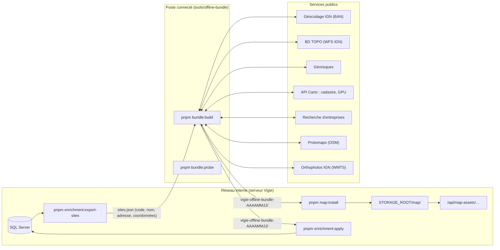

# Paquet hors ligne : enrichissement et carte

Vigie tourne sur un réseau fermé : **le serveur ne joint jamais internet**. Les données publiques (géocodage, emprises des bâtiments, risques, cadastre, urbanisme, entreprises) et les ressources cartographiques (fond de carte, orthophotographies, polices, symboles) sont préparées sur un **poste connecté**, apportées sous forme de **paquet**, vérifiées puis installées sur le serveur.

## Vue d'ensemble



## Ce qui sort du réseau, et ce qui n'en sort jamais

| Sort (fichier `sites.json`) | Ne sort jamais |
|---|---|
| `code`, `name`, `addressLine`, `postalCode`, `city`, `latitude`, `longitude` des sites **non archivés** | Baux, loyers, dates, préavis, données financières, contrats, surfaces, indicateurs, rubriques ICPE, exploitant, entité du bail, utilisateurs, journal d'audit, documents |

- Le schéma `exportedSiteSchema` (`src/domain/enrichment-format.ts`) est **strict** : un champ supplémentaire fait échouer l'export.
- La requête d'export sélectionne ces seuls champs (liste blanche explicite).
- Chaque export est tracé dans le journal d'audit : action `ENRICH`, type `EnrichmentExport`, auteur, nombre de sites, empreinte SHA-256.
- Les services publics reçoivent seulement une adresse, des coordonnées ou un code INSEE. Le nom du site ne quitte pas le poste connecté : il sert uniquement au rapprochement ICPE local.
- **Entreprises** : le nom de l'exploitant et celui de l'entité du bail ne sont pas exportés. Les SIREN candidats sont donc cherchés **par proximité** (établissements à moins de 250 m). La comparaison avec `logisticsOperator` se fait dans Vigie.

## Procédure complète

### 1. Sur le serveur Vigie : exporter les sites

```bash
pnpm enrichment:export-sites --out sites.json --actor admin@vigie.local
```

Copier `sites.json` sur le poste connecté (support amovible, selon la politique de la DSI).

### 2. Sur le poste connecté : préparer le paquet

Prérequis :
- une copie du dépôt, `pnpm install` ;
- le programme **`pmtiles`** ([go-pmtiles](https://github.com/protomaps/go-pmtiles/releases)), sauf avec `--skip-map --skip-ortho`. S'il est absent, l'outil affiche les instructions d'installation et s'arrête **avant** tout appel réseau.

```bash
# Vérifier les formats réels sur 1 site : réponses brutes dans probe-output/
pnpm bundle:probe --sites sites.json --limit 1

# Paquet complet
pnpm bundle:build --sites sites.json --out D:\paquets
```

Options de `bundle:build` :

| Option | Défaut | Effet |
|---|---|---|
| `--providers a,b` | tous | Sous-ensemble : `geocoding`, `buildings`, `georisques` (P1) ; `cadastre`, `urbanisme`, `companies` (P2) |
| `--skip-map` | — | Pas de fond de carte, de polices ni de symboles |
| `--skip-ortho` | — | Pas d'orthophotographies |
| `--maxzoom` | 14 | Zoom maximal du fond de carte (15 au plus) |
| `--ortho-radius` | 500 | Rayon (m) des orthophotographies autour de chaque site |
| `--fixtures` | — | **Aucun accès réseau** : réponses synthétiques de `__fixtures__/` (démonstration et tests) |
| `--work` | `.bundle-work` | Dossier de travail : cache des réponses et progression |
| `--basemap-url` | dernier build | Source explicite du fond de carte (fichier `.pmtiles` distant) |

**Reprise.** Chaque réponse brute est mise en cache sur disque (`.bundle-work/http-cache/`), et chaque site terminé est enregistré dans `.bundle-work/progress/`. Après une interruption (coupure réseau, Ctrl+C), relancer la même commande : les sites terminés sont rechargés sans aucun appel, et la préparation reprend au site suivant.

**Tolérance aux pannes.** L'échec d'un service est enregistré pour ce site et ce service (`status: "error"`, message), puis la préparation continue. Chaque requête a un délai maximal de 15 s et jusqu'à 3 nouvelles tentatives sur les réponses 429 et 5xx, avec une attente qui double à chaque essai (l'en-tête `Retry-After` est respecté). Le débit est limité à 5 requêtes par seconde et par service. Chaque requête porte l'en-tête `User-Agent: Vigie-offline-bundle/<version>`.

Contenu produit :

```
vigie-offline-bundle-AAAAMMJJ/
├── manifest.json        # fichiers (taille, SHA-256), sources, licences, attributions, paramètres
├── SHA256SUMS           # format sha256sum, couvre tous les fichiers dont manifest.json
├── enrichment.json      # données et propositions par site et par fournisseur
└── map/
    ├── france.pmtiles       # fond vectoriel France (Protomaps, OSM)
    ├── ortho-sites.pmtiles  # orthophotos IGN autour des sites (z15–18)
    ├── fonts/<police>/<plage>.pbf
    └── sprites/v4/dark[@2x].{json,png}
```

Le paquet est assemblé dans `<nom>.partial/`, puis renommé une fois complet. Un dossier du même jour n'est jamais écrasé.

### 3. Sur le serveur Vigie : installer la carte

```bash
pnpm map:install --bundle vigie-offline-bundle-AAAAMMJJ --actor admin@vigie.local
```

Étapes de l'installation :
1. Contrôle du format du manifeste, puis de **chaque** somme de `SHA256SUMS`, manifeste compris. Toute différence fait refuser le paquet, sans rien modifier.
2. Copie de `map/` dans un dossier temporaire à côté de la cible, puis écriture de `manifest.json`.
3. Bascule par renommage : la carte en place passe dans `STORAGE_ROOT/map.previous/`, le dossier temporaire devient `STORAGE_ROOT/map/`.
4. Ligne d'audit (`IMPORT`, type `MapBundle`).

**Retour à la version précédente** :

```bash
pnpm map:install --rollback --actor admin@vigie.local
```

Les deux versions sont échangées : l'actuelle devient à son tour `map.previous/`.

Les fichiers sont servis par `GET|HEAD /api/map-assets/<chemin>` (session requise, permission `site:read`). La route gère :
- les requêtes `Range` (206, `Content-Range`, `Accept-Ranges`, 416) ;
- `ETag` avec `If-None-Match` (304) ;
- `Cache-Control: private, max-age=86400` ;
- la lecture en flux.

Elle répond 400 à un chemin suspect (`..`, fichier caché, séparateur) et 404 à un fichier absent.
- **Plages multiples** : seule la première plage satisfiable est servie, en réponse 206 simple. PMTiles et MapLibre n'envoient que des plages uniques.
- `GET /api/map-assets/status` renvoie `{ installed, manifest }` : nom, dates, tailles, sources et attributions, sans aucun chemin interne.

### 4. Sur le serveur Vigie : appliquer l'enrichissement

```bash
# Toujours simuler d'abord (aucune écriture en base), lire le rapport
pnpm enrichment:apply --file vigie-offline-bundle-AAAAMMJJ/enrichment.json --actor admin@vigie.local --dry-run
# Application réelle (rejouable : un second passage n'écrit rien)
pnpm enrichment:apply --file vigie-offline-bundle-AAAAMMJJ/enrichment.json --actor admin@vigie.local
```

**Règle : l'enrichissement ne remplit que les champs vides.**

| Situation | Résultat |
|---|---|
| Champ vide, confiance ≥ 0,8 | **Appliqué** |
| Champ vide, confiance < 0,8 | Non appliqué (« confiance insuffisante ») |
| Champ vide, mais dernière écriture depuis l'interface ou par un enrichissement précédent (champ vidé volontairement) | **Préservé** et compté |
| Même valeur | Rien |
| Valeur différente | **Divergence** : listée dans `divergences.csv`, **jamais appliquée** |

Règles complémentaires :
- **Latitude et longitude** sont appliquées ensemble, seulement si les deux sont vides. `coordinatesSource` passe alors à `enrichment`.
- **Emprise** : `SiteGeometry` est créé s'il n'existe pas, avec `source = enrichment`, `sourceRef` (identifiant BD TOPO) et `fetchedAt`.
- **Lien Géorisques** : `SiteIcpe` est créé s'il n'existe pas.
- **`site_public_data`** : les couples (fournisseur, clé) présents dans le fichier sont remplacés, les autres ne sont pas touchés. Une valeur identique n'est pas réécrite.
- **Traçabilité** : chaque écriture passe par `runWithAuditContext({ source: "enrichment", batchId })`. Le journal reçoit une ligne par champ modifié et une ligne récapitulative `ENRICH` par site. Le lot est une ligne `ImportBatch` de type `ENRICHMENT`.
- **Sites ignorés** : les codes inconnus ou archivés sont listés, sans être modifiés.

Rapport dans `STORAGE_ROOT/enrichment/<lot>/` (ou `dry-run-<horodatage>/`). Les fichiers CSV sont en UTF-8 avec BOM, séparés par `;`, lisibles dans Excel.

| Fichier | Contenu |
|---|---|
| `divergences.csv` | code, champ, valeur actuelle, valeur proposée, source, preuve |
| `changes.csv` | Toutes les propositions et leur résultat |
| `checks.csv` | Contrôles informatifs calculés dans Vigie (données absentes de l'export) : emprise BD TOPO et surface totale de l'entrepôt, parcelles et surface du terrain (écart > 30 %), rubriques ICPE de Vigie et de Géorisques |
| `summary.json` | Compteurs, statut, lot, durée |

Codes de sortie : `0` succès, `2` succès partiel (échec d'un site), `1` échec.

## Fournisseurs

| Fournisseur | Priorité | Point d'accès | Produit |
|---|---|---|---|
| `geocoding` | P1 | `https://data.geopf.fr/geocodage/search` (et `/reverse` pour un site sans adresse) | Coordonnées si score ≥ 0,8 et type `housenumber` ou `street`, et seulement si le site n'a pas de coordonnées ou si l'écart dépasse 500 m (divergence) ; `communeInseeCode` ; `postalCode` |
| `buildings` | P1 | `https://data.geopf.fr/wfs/ows`, couche `BDTOPO_V3:batiment` | Bâtiments dans un rayon de 250 m. Le bâtiment qui **contient** le point du site l'emporte (confiance 0,9) ; sinon le plus grand (0,6, donc jamais appliqué automatiquement). Emprise (Polygon ou MultiPolygon), hauteur (`hauteur`, 0 = inconnue), `sourceRef` (`cleabs`), surface |
| `georisques` | P1 | `https://georisques.gouv.fr/api/v1/installations_classees`, `/gaspar/risques`, `/zonage_sismique`, `/radon` | Installations classées à moins de 1 km. Correspondance si le nom est proche (similarité ≥ 0,6, confiance 0,7) ou la distance inférieure à 200 m (0,8), les deux (0,9) → `SiteIcpe.georisquesUrl`. Rubriques de l'installation retenue. Risques de la commune, zonage sismique et potentiel radon → `site_public_data` |
| `cadastre` | P2 | `https://apicarto.ign.fr/api/cadastre/parcelle` | Parcelles qui intersectent l'emprise (ou le point) ; somme des contenances comparée à `landArea` |
| `urbanisme` | P2 | `https://apicarto.ign.fr/api/gpu/zone-urba` | Zones du PLU ou PLUi au point du site |
| `companies` | P2 | `https://recherche-entreprises.api.gouv.fr/near_point` | SIREN des établissements à moins de 250 m, **seulement listés** dans `site_public_data` |

Toutes les URL sont centralisées dans `tools/offline-bundle/config.ts`, avec leur source documentaire. Les réponses de `__fixtures__/` sont **synthétiques**, marquées « synthétique — à confirmer par probe ». Lancer `pnpm bundle:probe` sur le poste connecté, puis comparer `probe-output/` avec les fixtures avant la première préparation réelle.

## Carte

- **Fond vectoriel** : extraction de la France métropolitaine (emprise `-5.8,41.2,10,51.5`) depuis le **dernier build quotidien Protomaps** (index `https://build-metadata.protomaps.dev/builds.json`, fichiers `https://build.protomaps.com/AAAAMMJJ.pmtiles`), avec `pmtiles extract`. Seules les tuiles utiles sont téléchargées, par requêtes de plage. Zoom maximal 14 par défaut.
- **Polices et symboles** du thème sombre, depuis `protomaps/basemaps-assets` : Noto Sans Regular, Medium et Italic (latin, latin étendu, grec, cyrillique, ponctuation), symboles `v4/dark`.
- **Orthophotographies IGN** : WMTS `ORTHOIMAGERY.ORTHOPHOTOS`, TileMatrixSet `PM_0_19`, zooms 15 à 18, dans un rayon de 500 m autour de chaque site. Les tuiles sont calculées par un module pur et testé (`tiles.ts`), écrites dans un MBTiles intermédiaire (`node:sqlite`), puis converties avec `pmtiles convert`.

## Taille

La taille **réelle** est mesurée par l'outil et inscrite dans le manifeste. Au-delà de l'objectif de **2 Gio**, un avertissement propose de réduire `--maxzoom` ou `--ortho-radius`. Elle n'a pas pu être mesurée pendant le développement, faute d'accès réseau ; les estimations suivantes sont donc à confirmer au premier vrai paquet :
- **Orthophotos** : environ 150 tuiles par site isolé (≈ 4 au zoom 15, 9 au zoom 16, 30 au zoom 17, 110 au zoom 18, à 46° N), soit 3 à 6 Mio par site en JPEG, ou 0,6 à 1,2 Gio pour 200 sites (moins si des sites sont proches). Durée : environ 30 000 tuiles à 5 requêtes par seconde, soit 1 h 40 environ.
- **Fond de carte** : chaque niveau de zoom en moins divise la taille par 3 à 4 environ. Si le paquet dépasse l'objectif, commencer par `--maxzoom 13`.
- **Paquet en mode `--fixtures`** (30 sites, sans carte) : 228 Kio.

## Mise à jour trimestrielle

1. Exporter `sites.json` (les sites créés entre-temps y figurent).
2. Sur le poste connecté : `pnpm bundle:probe --sites sites.json --limit 1`, puis comparer `probe-output/` avec la préparation précédente (les formats des services peuvent changer).
3. `pnpm bundle:build` : les orthophotos et les réponses en cache sont réutilisées. Pour repartir de zéro, supprimer `.bundle-work/`.
4. Sur le serveur : `pnpm map:install` (la version en place passe dans `map.previous/`), puis `enrichment:apply --dry-run` et `enrichment:apply`.
5. Traiter les divergences à la main, dans la fiche du site (étape 9).

## Licences et attributions

Les licences et attributions sont inscrites dans le manifeste, et donc exposées par `/api/map-assets/status` pour l'affichage sur la carte.

| Source | Licence | Attribution |
|---|---|---|
| Fond Protomaps (données OpenStreetMap) | ODbL 1.0 (données), CC0 (schéma) | © contributeurs OpenStreetMap, Protomaps |
| Polices et symboles basemaps-assets | SIL OFL 1.1 (Noto), CC0 (symboles) | Polices Noto (OFL), symboles Protomaps |
| Orthophotographies IGN | Licence Ouverte Etalab 2.0 | © IGN – BD ORTHO |
| Géocodage (BAN, IGN) | Licence Ouverte Etalab 2.0 | Base Adresse Nationale, IGN |
| BD TOPO | Licence Ouverte Etalab 2.0 | © IGN – BD TOPO |
| Géorisques | Licence Ouverte Etalab 2.0 | Géorisques – MTE / BRGM |
| Parcellaire Express | Licence Ouverte Etalab 2.0 | © IGN – DGFiP |
| Géoportail de l'Urbanisme | Licence Ouverte Etalab 2.0 | Géoportail de l'Urbanisme |
| Recherche d'entreprises (SIRENE) | Licence Ouverte Etalab 2.0 | Base SIRENE – INSEE |

## Séparation stricte

- `tools/offline-bundle/` est **le seul endroit du dépôt** autorisé à joindre internet. Il est hors de `src/`, n'est jamais importé par l'application (un test le vérifie) et n'entre pas dans le build Next.js. Il reste couvert par le typecheck, le lint et les tests (`tools/**/__tests__`).
- `pnpm check:offline` scanne toujours `src/` et `public/`, sans exception.
- Les formats partagés (`src/domain/enrichment-format.ts`, `src/domain/bundle-manifest.ts`) sont de purs schémas zod, sans URL.
